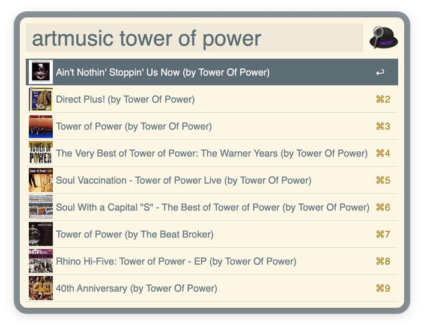

# iTunes Artwork Search

**This workflow _requires_ Alfred 5.**

An Alfred 5 workflow for searching for music, TV, or movie cover artwork.

Based on @scottfwalter’s [iTunes Artwork Search](https://www.alfredforum.com/topic/4701-get-itunes-artwork/), which in turn was based on @bendodson’s [iTunes Artwork Finder](https://github.com/bendodson/itunes-artwork-finder/).

Rewritten in Ruby & expanded & updated for Alfred 5.

## User Configuration

You can choose from a list of countries to search that specific iTunes Store instance.
